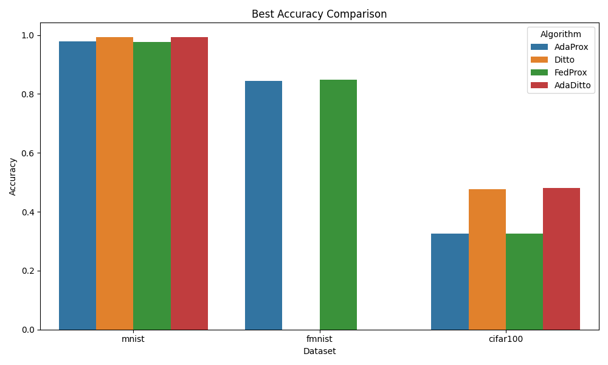
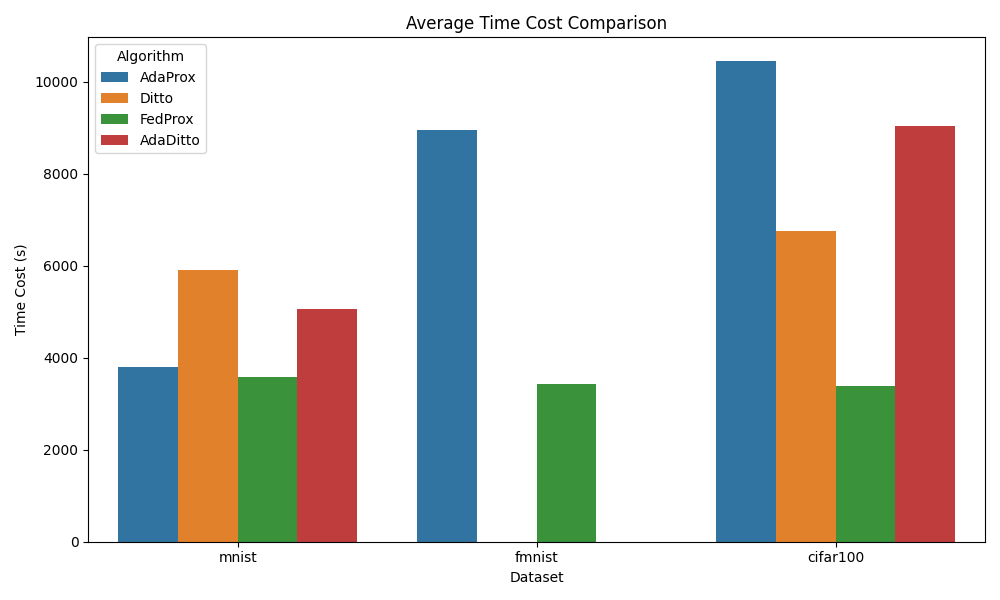

# Comparison Results Walkthrough

I have successfully compared the results of FMNIST, CIFAR100, and MNIST datasets using the `tools/compare_results.py` script.

## Changes Made

- Created `tools/compare_results.py` to parse `final_output.txt` files and generate comparison plots.
- Generated `comparison_accuracy.png` and `comparison_time.png` in `comparison_results` directory.

## Verification Results

### Automated Tests

The script ran successfully and generated the following output:

```text
Comparison Results:
    Dataset Algorithm  Accuracy  Time Cost (s)
0     mnist   AdaProx  0.978067        3804.18
1     mnist     Ditto  0.992118        5911.51
2     mnist   FedProx  0.977439        3590.61
3     mnist  AdaDitto  0.992289        5063.94
4    fmnist   FedProx  0.847547        3426.43
5    fmnist   AdaProx  0.844919        8950.49
6  cifar100   FedProx  0.325959        3374.86
7  cifar100   AdaProx  0.326559       10440.50
8  cifar100  AdaDitto  0.479811        9034.75
9  cifar100     Ditto  0.477212        6745.29
```

### Visual Comparison

#### Accuracy Comparison



#### Time Cost Comparison


